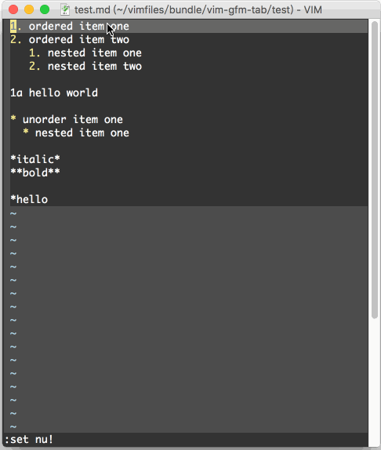

# vim-kramdown-tab

A vim plugin to resolve indent issue of content nested in  Markdown lists, especially for kramdown.

With kramdown(GitHub Pages' default Markdown engine), the indent rule for content nested in lists is:

* Good

  ```markdown
  1. ordered item one
     nested content here
  2. ordered item two

  * unorder item one
    nested content here
  * unorder item two
  ```

* bad

  ```markdown
  1. ordered item one
      nested content here
  2. ordered item two

  * unorder item one
      nested content here
  * unorder item two
  ```

<kbd>Tab</kbd> key doesn't know how to indent! This plugin is to rescue your <kbd>Tab</kbd>.

## Usage

When you want to indent your content nested in lists, just press <kbd>Leader</kbd><kbd>Tab</kbd>.

## Installation

Suggest to manage your vim plugins via [Vundle][1] so you can install it simply three steps:

1. add the following line to your vimrc file

    ```
    Plugin 'mzlogin/vim-kramdown-tab'
    ```

2. `:so $MYVIMRC`

3. `:PluginInstall`

## Screenshots



[1]: http://github.com/VundleVim/Vundle.Vim
